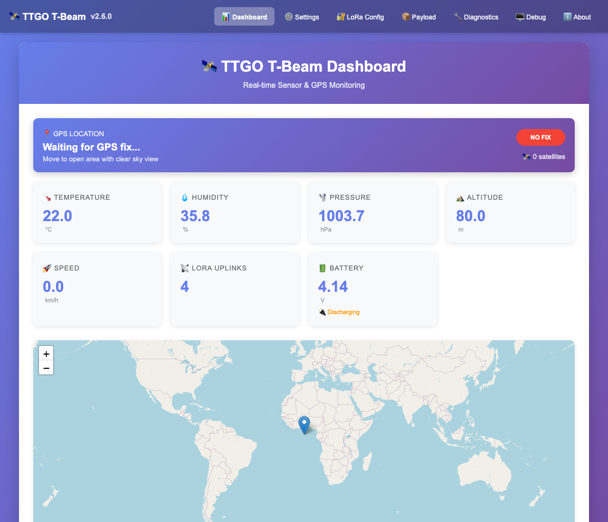
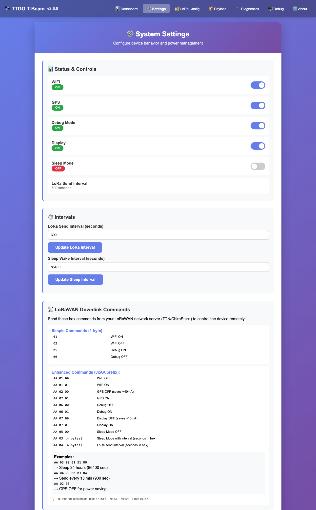
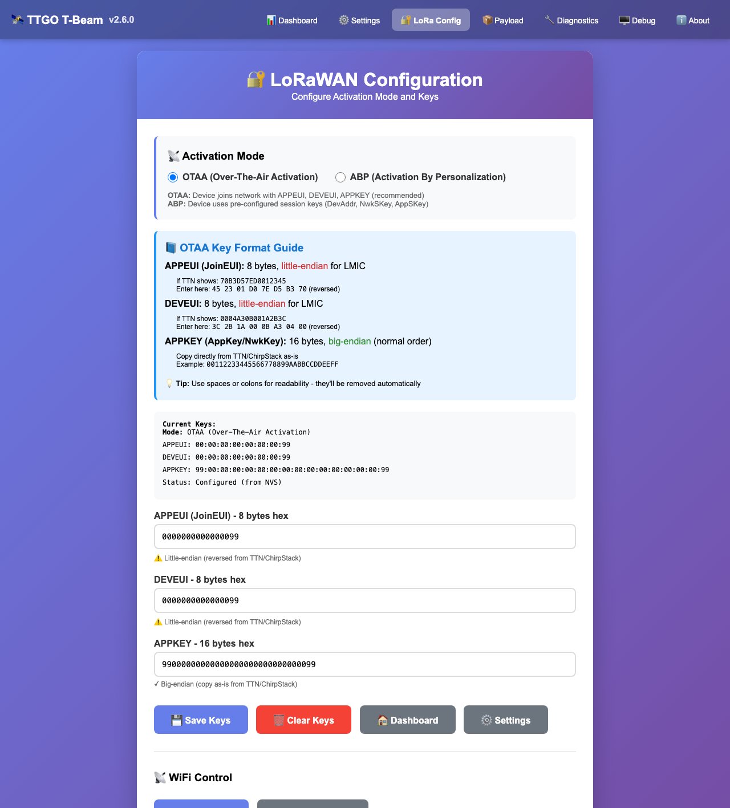
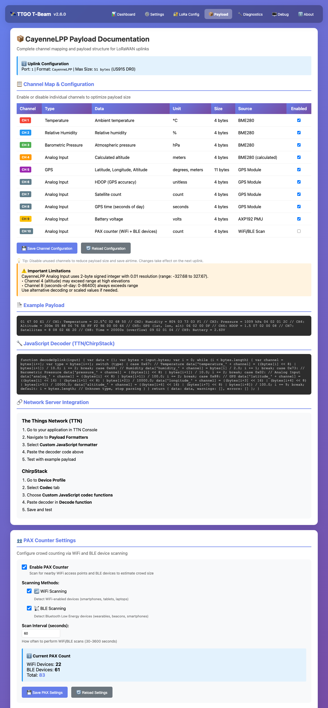
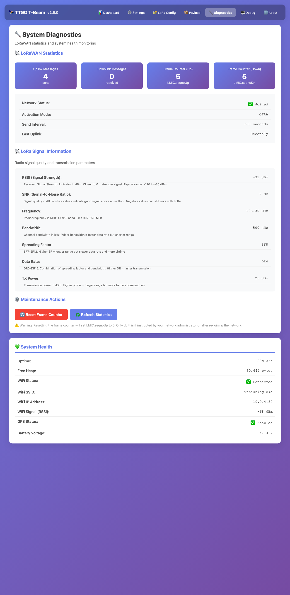
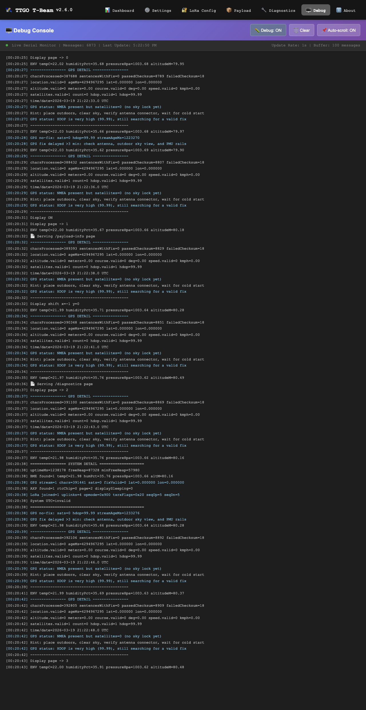
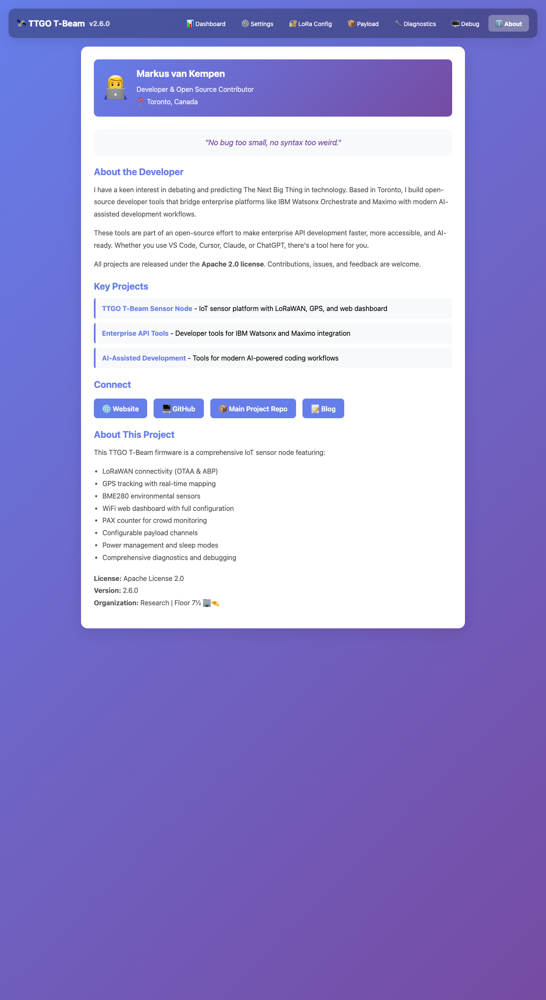

# TTGO T-Beam (T22 V1.1) Sensor Node

**Version:** 2.7.4
**Author:** Markus van Kempen
**Email:** Markus.van.Kempen@gmail.com
**Organization:** Research | Floor 7½ 🏢🤏
**Motto:** "No bug too small, no syntax too weird."
**License:** Apache License 2.0 (see [LICENSE](LICENSE))

---

This project runs on a TTGO T-Beam T22 V1.1 and integrates:
- BME280 (temperature, humidity, pressure)
- GPS (UART, TinyGPS++) with AXP192 power management
- OLED (SSD1306) with anti-burn-in
- LoRaWAN OTAA & ABP (LMIC, US915)
- CayenneLPP payload formatting with configurable channels
- **WiFi Web Dashboard** with real-time sensor data and GPS tracking
- **WiFi Manager** for easy configuration
- **OpenStreetMap integration** with live GPS marker (no API key required!)
- **PAX Counter** for crowd monitoring (WiFi + BLE scanning)
- **Diagnostics Page** with frame counter reset
- **Payload Configuration** page with channel enable/disable

## Hardware Notes

### Board/pin assumptions
- I2C SDA/SCL: `21/22`
- GPS UART (T22 V1.1): `RX=34`, `TX=12`
- LoRa SX1276 pins:
  - NSS: `18`
  - RST: `23`
  - DIO0/DIO1/DIO2: `26/33/32`

### Power management (AXP192)
On T22 boards, GPS depends on PMU rails being enabled. The firmware enables the required AXP192 outputs at boot.

## LoRaWAN Configuration

Region is configured in [platformio.ini](platformio.ini) (currently US915).

OTAA keys are configured in [include/lorawan_secrets.h](include/lorawan_secrets.h):
- `APPEUI` (JoinEUI, little-endian for LMIC)
- `DEVEUI` (little-endian for LMIC)
- `APPKEY` (big-endian)

## CayenneLPP Uplink Structure

Uplink port: `1`

Current channel map (all configurable via web UI):
1. Channel `1` -> Temperature (`addTemperature`) from BME280
2. Channel `2` -> Relative Humidity (`addRelativeHumidity`) from BME280
3. Channel `3` -> Barometric Pressure (`addBarometricPressure`) from BME280
4. Channel `4` -> Analog Input (`addAnalogInput`) for BME altitude
5. Channel `5` -> GPS (`addGPS`) lat/lon/alt
6. Channel `6` -> Analog Input for HDOP (Horizontal Dilution of Precision - GPS accuracy metric, lower is better: <1=ideal, 1-2=excellent, 2-5=good, 5-10=moderate, 10-20=fair, >20=poor)
7. Channel `7` -> Analog Input for satellite count
8. Channel `8` -> Analog Input for GPS seconds-of-day
9. Channel `9` -> Analog Input for battery voltage (volts)
10. Channel `10` -> Analog Input for PAX counter (WiFi + BLE device count) - **NEW**

**Note:** Individual channels can be enabled/disabled via the `/payload-info` web page to reduce payload size and save airtime.

Source: [src/main.cpp](src/main.cpp)

## Important CayenneLPP Limits

Cayenne Analog Input is 2-byte signed with 0.01 resolution (about -327.68 to 327.67).

This affects:
- Channel `4` altitude (can exceed range)
- Channel `8` seconds-of-day (0..86400 always exceeds range)

If decoded values look wrong, this is expected with current mapping. Use scaled/alternate fields if needed.

## Serial Debugging

The firmware has two modes:

**Normal Mode (debug-off):**
- Shows only important events (joins, errors, downlinks)
- Minimal output for production use
- User commands always work
- Clean, quiet operation

**Debug Mode (debug-on):**
- Detailed GPS parser state
- LoRa event flow (`EV_JOINING`, `EV_TXSTART`, `EV_TXCOMPLETE`, etc.)
- Periodic system health block (heap, sensor status, LoRa counters)
- Display page rotations and burn-in shifts
- Optional raw NMEA sentence dump for first 30s after boot

**Toggle Debug Mode:**
- Serial: `debug-on` / `debug-off`
- Downlink: `0x05` (ON) / `0x06` (OFF)

**Always Shown (regardless of debug mode):**
- ✓ Network join success
- ✗ Join/rejoin failures
- 📥 Downlink messages
- User command responses
- Boot banner and menu

## WiFi Web Dashboard

This firmware includes a comprehensive web dashboard with multiple pages! See [END_TO_END_GUIDE.md](END_TO_END_GUIDE.md) for the complete setup and usage guide.

**Web Pages:**
- `/` - Dashboard with real-time sensor data and OpenStreetMap GPS tracking
- `/settings` - System settings (WiFi, GPS, Display, Sleep mode)
- `/config` - LoRaWAN configuration (OTAA/ABP keys)
- `/payload-info` - CayenneLPP documentation and channel configuration
- `/diagnostics` - System diagnostics with frame counter reset
- `/debug` - Live debug console with Serial output
- `/ota` - Over-the-Air firmware updates (URL or file upload)
- `/mqtt` - MQTT broker configuration and JSON payload publishing
- `/about` - Developer information and project details

**Quick Start:**
1. Upload firmware
2. Device creates WiFi AP: `TTGO-T-Beam-Setup` (password: `12345678`)
3. Connect and configure your WiFi
4. Access dashboard at device IP address
5. View real-time sensor data and GPS location on OpenStreetMap
### Web Dashboard Screenshots

> **Note:** Screenshots are stored in the `screenshots/` directory. See [END_TO_END_GUIDE.md](END_TO_END_GUIDE.md) for a full walkthrough of each page.

#### Dashboard - Real-time Sensor Data & GPS Tracking

*Live sensor readings with OpenStreetMap integration showing GPS location*

#### Settings - System Configuration

*Configure WiFi, GPS, display, and power management settings*

#### LoRa Configuration - OTAA/ABP Keys

*Manage LoRaWAN activation mode and security keys*

#### Payload Configuration - Channel Management

*Enable/disable CayenneLPP channels and configure PAX counter*

#### Diagnostics - System Health & Statistics

*Monitor uplink/downlink counters, frame counters, and system metrics*

#### Debug Console - Live System Output

*Real-time serial output and debug message streaming*

#### About - Project Information

*Developer details, license, and project information*


**Serial Commands:**
- `menu` - Interactive configuration menu
- `status` - Complete system status
- `wifi-on/off` - Enable/disable WiFi
- `gps-on/off` - Enable/disable GPS
- `display-on/off` - Enable/disable OLED display
- `sleep-on/off` - Enable/disable sleep mode
- `sleep-interval <sec>` - Set sleep wake interval
- `lora-interval <sec>` - Set LoRa send interval
- `lora-keys` - View/configure LoRa keys
- `mqtt-status` - Show MQTT configuration
- `mqtt-on/off` - Enable/disable MQTT publishing
- `mqtt-server <server>` - Set MQTT broker server
- `mqtt-port <port>` - Set MQTT broker port (1-65535)
- `mqtt-user <username>` - Set MQTT username
- `mqtt-pass <password>` - Set MQTT password
- `mqtt-topic <topic>` - Set MQTT topic
- `mqtt-device <name>` - Set device name
- `mqtt-interval <sec>` - Set publish interval (5-3600)
- `mqtt-test` - Test MQTT connection
- `mqtt-save` - Save MQTT settings to NVS
- `pax-on/off` - Enable/disable PAX counter
- `pax-wifi-on/off` - Enable/disable WiFi scanning
- `pax-ble-on/off` - Enable/disable BLE scanning
- `pax-interval <sec>` - Set PAX scan interval (30-3600)
- `pax-status` - Show PAX counter status
- `channel-enable <1-10>` - Enable payload channel
- `channel-disable <1-10>` - Disable payload channel
- `channel-status` - Show all channel states
- `debug-on/off` - Toggle verbose debugging
- `serial-on/off` - Enable/disable serial output (auto-mutes after 10 min inactivity)
- `help` - Show all commands

**LoRaWAN Downlink Control (Enhanced Protocol):**

*Simple Commands:*
- `01` - WiFi ON
- `02` - WiFi OFF
- `05` - Debug ON
- `06` - Debug OFF

*Enhanced Commands (0xAA prefix):*
- `AA 01 00/01` - WiFi OFF/ON
- `AA 02 00/01` - GPS OFF/ON
- `AA 03 [4 bytes]` - Sleep mode with wake interval (seconds in hex)
- `AA 04 [4 bytes]` - LoRa send interval (seconds in hex)
- `AA 05 00` - Sleep mode OFF
- `AA 06 00/01` - Debug OFF/ON
- `AA 07 00/01` - Display OFF/ON

**Examples:**
```
AA 01 00        - WiFi OFF
AA 02 00        - GPS OFF (power saving)
AA 07 00        - Display OFF (power saving)
AA 03 00 01 51 80 - Sleep 24 hours (86400 sec)
AA 04 00 00 03 84 - Send every 15 minutes (900 sec)
```

See [END_TO_END_GUIDE.md#11-lorawan-downlink-commands](END_TO_END_GUIDE.md#11-lorawan-downlink-commands) for complete documentation with hex calculations and power management scenarios.

## Project Structure

```
TTGO-T-Beam-Sensor-Node-with-Web-Dashboard/
├── src/
│   └── main.cpp              # Main firmware (~11 000 lines)
├── include/
│   └── lorawan_secrets.h     # LoRaWAN credentials (not committed)
├── screenshots/              # Web UI screenshots (PNG)
├── CHANGELOG.md              # Full version history
├── END_TO_END_GUIDE.md       # Complete usage guide (this repo)
├── platformio.ini            # PlatformIO build configuration
└── README.md                 # This file
```

## Version History

See [CHANGELOG.md](CHANGELOG.md) for detailed version history and release notes.

**Current Version:** 2.7.4 (2026-03-24)
- **NEW:** OLED firmware update progress (shows KB written and status on display during OTA)
- **NEW:** MQTT support with JSON payload publishing
- **NEW:** MQTT configuration page (broker, port, credentials, topic)
- **NEW:** OTA firmware updates (URL download or file upload)
- **NEW:** GPS path tracking with configurable size (5-100 positions)
- **NEW:** Automatic GPS force-enable on boot (fixes LED not blinking issue)
- **NEW:** MQTT status in diagnostics page
- PAX Counter mode (WiFi + BLE device scanning)
- Payload configuration with channel enable/disable
- Diagnostics page with frame counter reset
- ABP mode support in web UI
- NVS persistence for all system settings
- Battery voltage display on OLED and web dashboard
- Apache License 2.0

## Build and Upload

```bash
platformio run
platformio run --target upload --upload-port /dev/cu.usbserial-01E5CD55
platformio device monitor --baud 115200 --port /dev/cu.usbserial-01E5CD55
```

See [END_TO_END_GUIDE.md](END_TO_END_GUIDE.md) for the complete setup walkthrough, serial command reference, OTA instructions, and troubleshooting guide.


## Troubleshooting Quick Guide

### Joins but no application data
- Confirm you are checking **uplink events**, not only join events.
- Confirm payload arrives on `FPort 1`.
- Check serial for `LoRa uplink #... payload=...`.

### GPS has NMEA but no fix (`sats=0`, `hdop=99.99`)
- UART is working; this is usually no sky lock yet.
- Move outdoors with clear sky and wait for cold-start lock.
- Verify GPS antenna connector and placement.

### Wrong system time
- Clock sync now only accepts plausible GPS date/time + fix quality.
- If no fix, system clock remains unsynced (expected).

### GPS LED not blinking (NO POWER)
**This is the most common GPS issue!** The blue LED not blinking means GPS has no power.

**Quick Fix (Serial Monitor):**
```
gps-on
```
You should immediately see: `✓ GPS power enabled (AXP192 LDO3 ON)` and the blue LED will start blinking within 1-2 seconds.

**Quick Fix (Web Dashboard):**
1. Go to `http://YOUR_DEVICE_IP/settings`
2. Toggle "GPS Enable" to **ON**
3. Click "Save Settings"
4. Blue LED should start blinking within 2-3 seconds

**Automatic Fix (v2.6.1+):**
The firmware now automatically detects if GPS is disabled in NVS and forces it ON during boot. You'll see:
```
⚠️  GPS was disabled in NVS - forcing GPS ON
✓ GPS power enabled (AXP192 LDO3 ON)
```

**If LED still doesn't blink:**
- Check Serial Monitor for "AXP192 not found" - indicates I2C issue
- Verify GPS antenna is connected to U.FL connector
- Check power supply (USB or battery voltage)
- See [GPS_TROUBLESHOOTING guide](END_TO_END_GUIDE.md#13-troubleshooting) for detailed diagnostics

### Web pages showing 500 errors
- Check Serial Monitor for page serving messages
- Look for syntax errors or missing closing braces
- Verify HTML string literals are properly closed
- Check free heap memory (should be >50KB)

## New Features

### MQTT Support
Publish sensor data to any MQTT broker in JSON format. Configure via `/mqtt` page:
- **Broker Settings**: Server hostname/IP, port (default 1883)
- **Authentication**: Optional username and password
- **Topic Configuration**: Customize MQTT topic (default: `ttgo/sensor`)
- **Enable/Disable**: Toggle MQTT publishing on/off
- **Test Connection**: Verify broker connectivity
- **JSON Payload**: Complete sensor data in structured JSON format
- **Status Monitoring**: View connection status and publish count in diagnostics

**JSON Payload Structure:**
```json
{
  "device": "TTGO-T-Beam",
  "timestamp": 12345,
  "bme280": {
    "temperature": 22.5,
    "humidity": 45.2,
    "pressure": 1013.25,
    "altitude": 123.4
  },
  "gps": {
    "latitude": 51.5074,
    "longitude": -0.1278,
    "altitude": 11.0,
    "satellites": 8,
    "hdop": 1.2,
    "speed": 0.0,
    "course": 0.0
  },
  "battery_voltage": 4.1,
  "battery_current": 150,
  "battery_charging": true,
  "pax": {
    "wifi": 5,
    "ble": 3,
    "total": 8
  },
  "system": {
    "uptime": 3600,
    "free_heap": 180000,
    "wifi_rssi": -45,
    "lora_joined": true
  }
}
```

### OTA Firmware Updates
Update firmware remotely via `/ota` page:
- **URL-based Update**: Download firmware from HTTP/HTTPS URL
- **File Upload**: Upload firmware binary directly from browser
- **Progress Tracking**: Real-time progress indicator
- **Automatic Reboot**: Device restarts after successful update
- **Error Handling**: Clear error messages for troubleshooting

### GPS Path Tracking
Track and visualize GPS movement history:
- **Configurable Size**: Store 5-100 GPS positions (default: 20)
- **Polyline Visualization**: Draw path on OpenStreetMap
- **NVS Persistence**: Path size setting survives reboots
- **API Endpoint**: `/api/gps-history` returns JSON array of positions
- **Web UI Control**: Adjust path size via `/settings` page

### PAX Counter
Scan for nearby WiFi access points and BLE devices to estimate crowd size:
- Enable/disable PAX counting
- Set scan interval (30-3600 seconds)
- View real-time device counts
- Data sent on Channel 10 (optional)
- Configure via `/payload-info` page

### Channel Configuration
Individual payload channels can be enabled/disabled via `/payload-info` page:
- Reduces payload size
- Saves airtime
- Optimizes battery life
- Changes take effect on next uplink

### Diagnostics
The `/diagnostics` page provides:
- Uplink/downlink message counters
- Frame counter display (LMIC.seqnoUp/seqnoDn)
- Frame counter reset button
- LoRa signal information (RSSI, SNR, frequency, data rate)
- WiFi connection details
- MQTT connection status and publish count
- System health metrics
- Auto-refresh every 5 seconds

## Developer

**Markus van Kempen**
- Email: Markus.van.Kempen@gmail.com
- Organization: Research | Floor 7½ 🏢🤏
- GitHub: [@markusvankempen](https://github.com/markusvankempen)
- Website: [markusvankempen.github.io](https://markusvankempen.github.io/)

*"No bug too small, no syntax too weird."*
